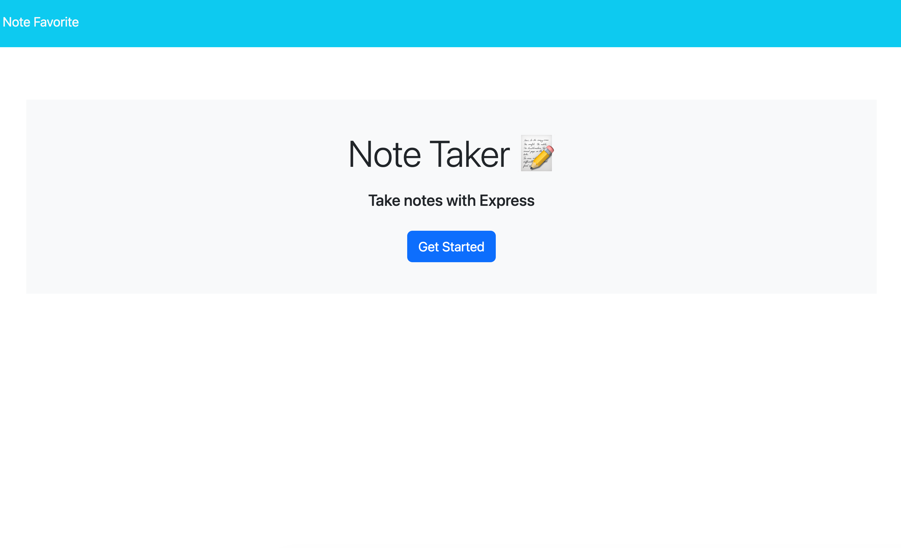
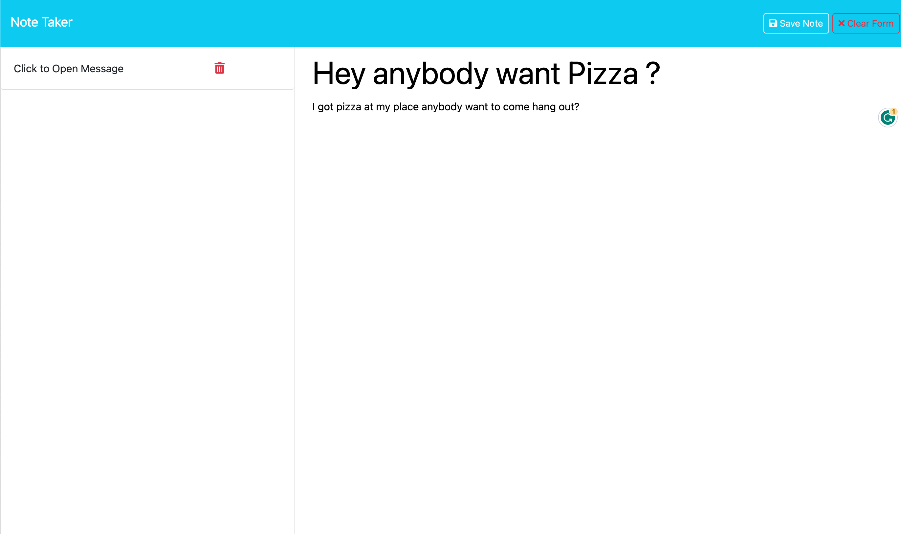

# NOTE FAVORITE WEBSITE USING EXPRESS JS

[Go to Note Favorite](https://notefavorite-j-80588266bd0c.herokuapp.com/)

[Go to Github Repository](https://github.com/Truecoding4life/Note-Favorite)

[Check out my other works](https://truecoding4life.github.io/Jaystudio/#contact)

## Description 

Welcome to Note Favorite, the perfect platform for sharing your thoughts and brightening someone's day, all while staying anonymous. Post notes, send a quick 'hi,' or share the joke of the day with friends and strangers alike. Spread positivity, make someone smile, and connect through the power of anonymous notes. Join us at Note Favorite and start sharing your favorite notes today!

## Table of Contents

* [Installation](#installation)
* [Usage](#usage)
* [User Interface]()

## User Interface

Once you are at the homepage click get start to begin sending notes

This Website is straightforward and simple to use, all the tools you'd need is in the left hand side that allow you to post and clear current note.

## Installation 

Installing Note Favorite is a breeze, and you'll be up and running in no time. Follow these steps to get started:

1.  Open your web browser and navigate to [Website URL] (replace with the actual URL of your website).

2. When you first arrive on the website, you'll have to click on "Create Note" to begin crafting your anonymous message. You can add text.

3. Once your note is created, you can share it with friends or the public. You can also explore other notes on the platform, like, share, and connect with users.

## Usage

1. **Create a Note:** Click on the "Create Note" button to start crafting your anonymous message. Share a kind thought, a quick hello, or even the joke of the day.

2. **Customize Your Note:** Personalize your message with fonts, colors, and styles. Make it uniquely yours!

3. **Go Public:** Share it with the world.

4. **Stay Anonymous:** Rest assured, your identity remains a secret. We value your privacy.

5. **Discover Notes:** Browse through a feed of heartwarming, funny, and intriguing notes from other users. Make someone's day by liking or 6.sharing their note.

6. **Spread Positivity:** Let Note Favorite be your canvas for positivity and connection. Share a smile, make a friend, and brighten someone's day, one note at a time.

7. **Connect with Friends:** Use Note Favorite to send anonymous messages to friends and keep the fun and surprises going.

---
*This README was generated based on the Good README Guide*

 

Make Your Website Everyday Better.

© Jay's Studio 2023.